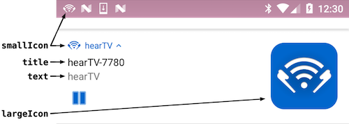

# hearTV Android Library

## Example
*todo*

## Installation
###### Add Service
1. Open your app project in Android Studio.
2. Choose **File** > **New** > **New Module...**.
3. Select **Import .JAR/.AAR Package**, then click **Next**.
4. Click the "**...**" button next to the **File name** field.
5. Navigate to and choose the **hearTVservice.aar** file, then click **OK**.
6. Click **Finish**.

###### Update build.gradle
1. The hearTV Service requires Android SDK version 16 or higher.  In your project's **build.gradle** file, ensure that `minSdkVersion` is at least 16. 
2. In your app's **build.gradle** file, add the following within the `dependencies` section:
```
compile project(':hearTVservice')
```
* Android Studio will show a notification indicating that the Gradle files have changed.  In this notification, click **Sync Now**.

###### Update AndroidManifest.xml
1. In your project's **AndroidManifest.xml** file, add the following within the `<application>` section:   
```
<service
    android:name="com.hearTVservice.hearTVservice"
    android:enabled="true"></service>
```

###### Import
1. In the Activity that will be using hearTV, add the following import statement:
```
import com.hearTVservice.hearTVservice;
```

## Usage

#### Service Connection
The hearTV library consists of a [Bound Service](http://developer.android.com/guide/components/bound-services.html) called `hearTVservice`.  To use the service, implement a `ServiceConnection` to monitor the connection with the service and to save a reference to the service.  
```Java
private hearTVservice mHearTVservice;

private ServiceConnection hearTVserviceConnection = new ServiceConnection() {

    @Override
    public void onServiceConnected(ComponentName name, IBinder service) {
        hearTVservice.hearTVserviceBinder binder = (hearTVservice.hearTVserviceBinder) service;
        mHearTVservice = binder.getService();
    }

    @Override
    public void onServiceDisconnected(ComponentName name) {
    
    }
};
```

---

#### Intents
Before initializing the hearTV service, register receivers for the various intents broadcast by the service.

**`HTVIntentWillStartSearchingForSources`**  
This intent is broadcast when the service is searching for sources.  This may take several seconds, so it's a good idea to use this intent to display feedback to the user, such as an indeterminate progress.  For example:  

```Java
progressDialog = ProgressDialog.show(this, "", "Finding hearTV Sources", true, false);
```

**`HTVIntentDidStopSearchingForSources`**  
This intent is broadcast when the service is done searching for sources.  Use this intent to update the UI.  For example:

```Java
progressDialog.dismiss();
```

**`HTVIntentSourceListChanged`**  
Use `getSourceNames()` to retrieve the currently available audio sources.  This intent includes a boolean intent extra called `HTVIntentExtraSourceListWasReset` that indicates whether the source list was reset prior to this update.  

**`HTVIntentNoSourcesFound`**  
When this intent is broadcast, display a message to the user.  The contents of the message are defined by two string intent extras: `HTVIntentExtraMessage1` and `HTVIntentExtraMessage2`.

**`HTVIntentPlaybackStatusChanged`**  
Use `public HTVPlaybackStatus getCurrentPlaybackStatus()` to get the current status in an `HTVPlaybackStatus` object, which contains a `message` and `type`.

##### Example

**Register broadcast receivers:**
```Java
private void registerReceivers() {
    registerReceiver(willStartSearchingForSources, hearTVservice.HTVIntentWillStartSearchingForSources);
    registerReceiver(didStopSearchingForSources  , hearTVservice.HTVIntentDidStopSearchingForSources);
    registerReceiver(sourceListChanged           , hearTVservice.HTVIntentSourceListChanged);
    registerReceiver(noSourcesFound              , hearTVservice.HTVIntentNoSourcesFound);
    registerReceiver(playbackStatusChanged       , hearTVservice.HTVIntentPlaybackStatusChanged);
}

private void registerReceiver(BroadcastReceiver receiver, String intentString) {
    LocalBroadcastManager.getInstance(this).registerReceiver(receiver, new IntentFilter(intentString));
}
```

**Broadcast Receiver for `HTVIntentWillStartSearchingForSources`:**
```Java
private BroadcastReceiver willStartSearchingForSources = new BroadcastReceiver() {
    @Override
    public void onReceive(Context context, Intent intent) {
        // Update UI.  For example, show an indeterminate progress dialog.
    }
};
```

**Broadcast Receiver for `HTVIntentDidStopSearchingForSources`:**
```Java
private BroadcastReceiver didStopSearchingForSources = new BroadcastReceiver() {
    @Override
    public void onReceive(Context context, Intent intent) {
        // Update UI.  For example, hide an indeterminate progress dialog.
    }
};
```

**Broadcast Receiver for `HTVIntentSourceListChanged`:**
```Java
private BroadcastReceiver sourceListChanged = new BroadcastReceiver() {
    @Override
    public void onReceive(Context context, Intent intent) {
        String[] sources = mHearTVservice.getSourceList(false);
        // Update the list of sources being displayed
        
        boolean listWasReset = intent.getBooleanExtra(hearTVservice.HTVIntentExtraSourceListWasReset, true);
        // Optionally, do something else specific to your app if the source list was reset.
    }
};
```

**Broadcast Receiver for `HTVIntentNoSourcesFound`:**
```Java
private BroadcastReceiver noSourcesFound = new BroadcastReceiver() {
    @Override
    public void onReceive(Context context, Intent intent) {
        String errorMessage1 = intent.getStringExtra(hearTVservice.HTVIntentExtraMessage1);
        String errorMessage2 = intent.getStringExtra(hearTVservice.HTVIntentExtraMessage2);
        // Display an error message
    }
};
```

**Broadcast Receiver for `HTVIntentPlaybackStatusChanged`:**
```Java
private BroadcastReceiver playbackStatusChanged = new BroadcastReceiver() {
    @Override
    public void onReceive(Context context, Intent intent) {
        hearTVservice.HTVPlaybackStatus status = mHearTVservice.getCurrentPlaybackStatus();
        // Show the status message.

        switch (status.type) {
            // Update the UI depending on the various statuses.
            // For example, display or hide playback controls as needed.
        }
    }
};
```

---

#### Initialization
To initialize the library, start the service and then bind to it.  Ensure that this is called *after* registering broadcast receivers.
```Java
Intent intent = new Intent(getApplicationContext(), hearTVservice.class);
startService(intent);
bindService(intent, hearTVserviceConnection, Context.BIND_AUTO_CREATE);
```

---

#### Playback
**`public void startPlayingSource(String sourceName)`**  
Begins playback of the given source.  The value of `sourceName` must match a value retrieved using `getSourceNames()`.  

**`public void startPlayingMostRecentSource()`**  
Begins playback of the source that was most recently played.  If no source has been played yet, the first available source will be played.

**`public void startPlayingNextSource()`**  
During playback, this function begins playback of the next source source in the list.  This function does not start playback when playback is stopped.

**`public void startPlayingPreviousSource()`**  
During playback, this function begins playback of the previous source source in the list.  This function does not start playback when playback is stopped.

**`public void playPause()`**  
If called during playback, this function stops playback.  If called when playback is stopped, this functions starts the most recent source.

**`public void stopPlaying()`**  
Stop playback.

**`public HTVPlaybackStatus getCurrentPlaybackStatus()`**  
Returns the current status in an `HTVPlaybackStatus` object, which contains the following properties:  

| `HTVPlaybackStatus` Property | Description |
|------------------------------|-------------|
| `message`                    | `String` with a message that may be displayed to the user. |
| `type`                       | One of the following `int` values:<br> `htvPlaybackStatusTypeIdle`<br>`htvPlaybackStatusTypeConnecting`<br>`htvPlaybackStatusTypeConnectionFailed`<br>`htvPlaybackStatusTypeListening`<br>`htvPlaybackStatusTypeStopping` |

---

#### Source/Device Information
A `Device` represents a hearTV device on the local network.  Each device may have one or more audio inputs, which are represented as unique source names.  Use the following functions to retrieve information about a `Device`:  

| `Device` Property | Description |
|----------------------|-------------|
|`getName`             | `String` representing the name of the device. |
|`getDeviceID`         | `String` representing the device's MAC address. |
|`getSettingsURL`      | `String` that can be used to access the device's web-based configuration. |
|`getSourceNames`      | Array of `String`s representing the device's audio sources. |

Use the functions below to retrieve information about sources and devices available on the local network.  

**`public String[] getSourceNames();`**  
Returns an array of `String`s of the currently available audio sources.  

**`public Device[] getDevices()`**  
Returns an array of the currently available `Device`s.  

**`public Device getDeviceForSource(String sourceName)`**  
Returns a `Device` for the given source name.  The value of `sourceName` must match a value retrieved using `getSourceNames()`.

**`public String getCurrentSourceName();`**  
Returns the name of the source currently playing.  If playback is stopped, this function returns `null`.  

**`public String[] getSourceList(boolean includeHiddenSources)`**  
***Deprecated: Use `getSourceNames()` or `getDevices()` instead.***  
Returns the currently available audio sources.  Normally, `includeHiddenSources` should be `false`.  Use `true` only when displaying a list for the user to choose which source's settings configuration panel to display.

**`public String getSettingsURL(String sourceName)`**  
***Deprecated: Use `getDevices()` to obtain a list of devices and then use `getSettingsURL()` on the device instead.***  
Returns the URL that can be used to access the source's configuration panel.

**`public String getDeviceID(String sourceName)`**  
***Deprecated: Use `getDevices()` to obtain a list of devices and then use `getDeviceID()` on the device instead.***  
Returns the unique device identifier for the given source.  

---

#### Playback Notification Information
Playback information shown in the Android notification drawer (logo, track name, etc.) can be customized by implementing the `NotificationDataSource` interface.  This interface has one function:

**`PlaybackNotificationSettings getPlaybackNotificationSettings(String sourceName, Device device)`**  
Implement this function to return a `PlaybackNotificationSettings` object with the desired custom settings.  The following settings can be customized:



| Setting     | Description |
|-------------|-------------|
| `color`     | The accent color to use for the notification.  (The purpose of the accent color may vary between different versions of Android.) |
| `smallIcon` | The small icon resource, which will be shown in the Android device's status bar. |
| `largeIcon` | The large icon to be shown in the notification. |
| `text`      | A string to be displayed in the notification in place of "**hearTV**". |
| `title`     | A string to be displayed in the notification in place of the current source name. |

**`public void setNotificationDataSource(NotificationDataSource notificationDataSource)`**  
Set an object that implements the `NotificationDataSource` interface that will provide custom information for the playback notification.  

**`public void setPlaybackNotificationActivity(Class activityClass)`**  
Set the activity to be opened when the user taps the playback notification.  

---

#### Other
**`public native void setVolume(float volume)`**
Set the playback volume of the audio stream.  Valid values are 0 to 1.  